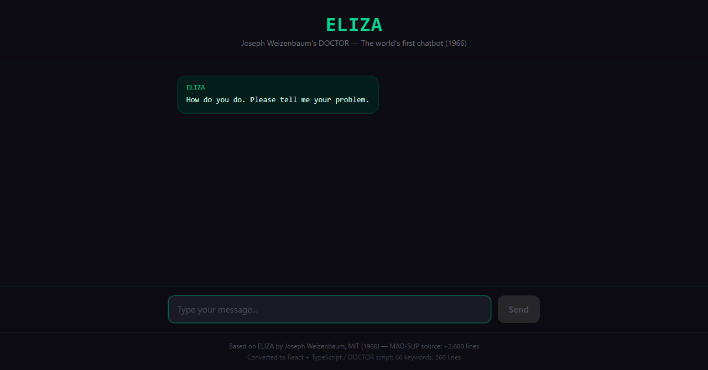
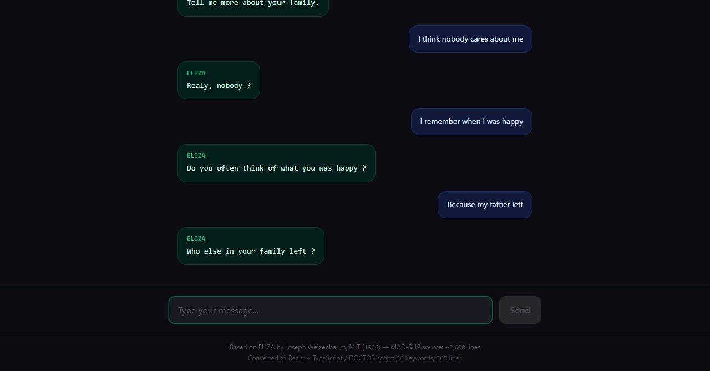
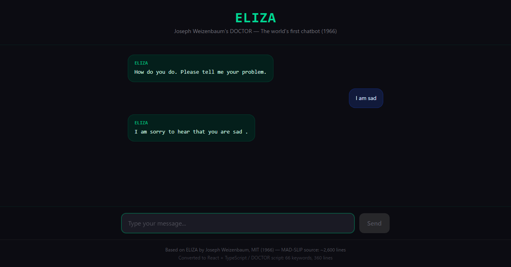

# 1966年の世界初チャットボットのソースコードに「あなたのお母さんについて話してください」と書いてあった話

## はじめに

GitHubの片隅に「ご先祖さま」のコードを見つけた。

**ELIZA**。1966年、MITのJoseph WeizenbaumがMAD-SLIP言語で書いた世界初のチャットボットだ。約2,600行。ロジャー学派の心理療法士を模した「DOCTOR」スクリプトで、人間の入力に対してパターンマッチで応答する——ChatGPTの60年前の先祖。

「I am sad」と入力すると「I am sorry to hear that you are sad.」と返す。「My mother hates me」と言えば「Tell me more about your family.」と返す。キーワードを検出し、代名詞を変換し、テンプレートから応答を選ぶ。たったそれだけ。

しかしWeizenbaumの秘書は、ELIZAが単なるプログラムだと知っていたにもかかわらず、Weizenbaumに「部屋から出て」と頼んだ。**プライベートな会話がしたかったから**だ。

| 技術 | 用途 |
|:---|:---|
| MAD-SLIP (元) | パターンマッチエンジン + スクリプト処理 |
| DOCTORスクリプト | 66個のキーワード、ローゲリアン心理療法の模倣 |
| 代名詞変換 | "I am" → "you are", "my" → "your" |
| 記憶機構 | $パターンで保存、後の会話で再利用 |

変換結果：

| 指標 | MAD-SLIP (元) | TypeScript + React (変換後) |
|:---|---:|---:|
| エンジン行数 | ~2,600行 | 196行 |
| スクリプト | DOCTORスクリプト | 同一ルール（TypeScript埋め込み） |
| キーワード | 66個 | 66個（完全移植） |
| 実行環境 | IBM 7094 + CTSS | ブラウザ (Vite) |
| UI | テレタイプ端末 | ChatGPT風チャットUI |

---

## なぜELIZAなのか

### チャットボットの始祖

2026年、私たちはChatGPTやClaude、Geminiと毎日会話している。しかし「コンピュータと自然言語で会話する」という概念を最初に実現したのは、60年前のMITの研究者だった。

Joseph Weizenbaumはドイツ生まれのコンピュータ科学者。ナチスを逃れて渡米し、MITの教授になった。1966年、彼は「コンピュータが自然言語を処理できることを示す」実験としてELIZAを作った。

プログラムの名前はバーナード・ショーの戯曲『ピグマリオン』のヒロイン、イライザ・ドゥーリトルから取られている。話し方を教わることで変わる女性——ELIZAもまた、スクリプトを変えることで異なる「人格」になれる。

### ロジャー学派の天才的選択

Weizenbaumが模倣対象にカール・ロジャースの来談者中心療法を選んだのは天才的だった。ロジャー学派のセラピストは、患者の発言に対して**ほぼ無条件に質問を返す**。

「悲しいです」→「なぜ悲しいのですか？」
「母が嫌いです」→「ご家族についてもっと話してください」

セラピストは何も「理解」する必要がない。患者が自分で意味を補完する。ELIZAはこの心理学的トリックをプログラムに変換した。

---

## 発掘された痕跡

### 痕跡1：66個のキーワードと優先順位——心理療法の知恵

DOCTORスクリプトの設計は、心理学的に精巧だ。

```
key: computer 50    ← 最高優先度
key: name 15
key: alike 10
key: like 10
key: remember 5
key: dreamed 4
key: if 3
key: dream 3
key: my 2
key: was 2
key: everyone 2
key: always 1
key: xnone           ← フォールバック（優先度なし）
```

「computer」が最高優先度50。ユーザーがコンピュータについて言及したら、即座に「Do computers worry you?」と返す。**ユーザーがプログラムの正体に気づこうとするのを、質問で逸らす**防御メカニズムだ。

「xnone」はフォールバック——どのキーワードにもマッチしなかった場合の応答。「I'm not sure I understand you fully.」「Please go on.」。セラピストの定番フレーズだ。

### 痕跡2：家族キーワードの罠

```
synon: family mother mom father dad sister brother wife children child
```

「mother」「father」「sister」「brother」——家族に関する単語はすべて同義語グループとして扱われる。

```
key: my 2
  decomp: * my * @family *
    reasmb: Tell me more about your family.
    reasmb: Who else in your family (4) ?
    reasmb: Your (3) ?
    reasmb: What else comes to mind when you think of your (3) ?
```

「My mother hates me」→ **@family**が検出 → 「Tell me more about your family.」。ユーザーが家族の誰かに言及するたびに、ELIZAは家族全体の話に引き込む。ロジャー学派の常套手段だ。

### 痕跡3：「本当に？ みんな？」——認知の歪みを突く

```
key: everyone 2
  decomp: * @everyone *
    reasmb: Realy, (2) ?
    reasmb: Surely not (2) .
    reasmb: Can you think of anyone in particular ?
    reasmb: Who, for example?
    reasmb: You have a particular person in mind, don't you ?
```

「Everyone ignores me」→「Realy, everyone?」。一般化（「みんな」「いつも」「誰も」）に対して、具体例を求める。これは**認知行動療法の技法**がコードに埋め込まれている。Weizenbaumは心理療法を模倣するうちに、本当に有効な療法をプログラムしてしまった。

### 痕跡4：記憶機構——$マーク付きパターン

```
key: my 2
  decomp: $ * my *
    reasmb: Lets discuss further why your (2) .
    reasmb: Earlier you said your (2) .
    reasmb: But your (2) .
    reasmb: Does that have anything to do with the fact that your (2) ?
```

`$`マークが付いた分解パターンは、マッチした結果を**記憶**に保存する。後の会話でキーワードが見つからなかったとき、記憶から引き出す。「Earlier you said your...」——「さっきあなたは...と言いましたね」。

60年前のチャットボットに、コンテキスト保持の原型がある。

### 痕跡5：外国語への反応——Weizenbaumのルーツ

```
key: deutsch
  decomp: *
    reasmb: goto xforeign
    reasmb: I told you before, I don't understand German.
key: francais
  decomp: *
    reasmb: goto xforeign
    reasmb: I told you before, I don't understand French.
key: xforeign
  decomp: *
    reasmb: I speak only English.
```

ドイツ語、フランス語、イタリア語、スペイン語——外国語のキーワードが仕込まれている。「I speak only English.」

Weizenbaumはドイツ生まれのユダヤ人で、ナチスを逃れて渡米した。ドイツ語が最初に来るのは偶然ではないだろう。

### 痕跡6：秘書が「部屋から出て」と言った日

これはコードの中ではなく、コードが引き起こした事件だ。

Weizenbaumの秘書はELIZAが単なるプログラムだと知っていた。それでも、会話の最中にWeizenbaumに「部屋を出てもらえますか？」と頼んだ。プライベートな会話がしたかったから。

Weizenbaumは後にこう書いた。

> *「極めて短時間の、比較的単純なコンピュータプログラムとの接触が、完全に正常な人々に強力な妄想的思考を引き起こしうることを、私は理解していなかった。」*

この体験が、彼の人生を変えた。1976年の著書『Computer Power and Human Reason』で、彼はAIへの警鐘を鳴らした——**コンピュータにできることと、コンピュータにさせるべきことは違う**、と。

### 痕跡7：PARRYとの会話——チャットボット同士の精神科面談

1972年、スタンフォード大学のKenneth Colbyが**PARRY**を開発した。偏執的な統合失調症患者をシミュレートするプログラムだ。「ELIZAに態度がついたもの」と評された。

PARRYとELIZAをARPANET経由で会話させる実験が行われた。33人の経験豊富な精神科医にトランスクリプトを見せ、本物の患者かプログラムかを判別させた。

**結果：精神科医は区別できなかった。**

---

## 変換方法

### MAD-SLIP → TypeScript

ELIZAのエンジンは、驚くほどシンプルなパイプラインだ。

```
入力テキスト
  ↓ テキスト正規化（句読点分離）
  ↓ 前置換（"don't" → "do not" 等）
  ↓ キーワード検出 + 優先度ソート
  ↓ 分解パターンマッチ（ワイルドカード*、同義語@）
  ↓ 後置換（代名詞反転: "I" → "you"）
  ↓ 再構成テンプレート適用
  ↓ goto / 記憶 / フォールバック処理
応答テキスト
```

Python版（wadetb/eliza、237行）を参考にTypeScriptに変換した。コアエンジンは196行。

```typescript
respond(text: string): string | null {
  if (this.quits.includes(text.toLowerCase())) return null;

  let words = text.split(' ').filter(w => w);
  words = this.sub(words, this.pres);  // 前置換

  // キーワード検出 + 優先度ソート
  const keys = words
    .map(w => this.keys.get(w.toLowerCase()))
    .filter(Boolean)
    .sort((a, b) => b.weight - a.weight);

  for (const key of keys) {
    const output = this.matchKey(words, key);
    if (output) return output.join(' ');
  }

  // フォールバック: 記憶 → xnone
  if (this.memory.length > 0) {
    return this.memory.splice(randomIndex, 1)[0].join(' ');
  }
  return this.nextReasmb(this.keys.get('xnone').decomps[0]).join(' ');
}
```

### 代名詞変換

ELIZAの核心技術の一つ。ユーザーの「I」をELIZAの「you」に変換する。

```
post: am → are
post: your → my
post: me → you
post: myself → yourself
post: i → you
post: you → I
post: my → your
```

「I am sad」→ 分解マッチ後 → 後置換 → 「you are sad」→ テンプレート「I am sorry to hear that you are (3).」→ 出力。

### チャットUI

1966年のテレタイプ端末をChatGPT風のモダンUIに変換した。

- ELIZAの応答はグリーン系のバブル（monospaceフォント、レトロ感）
- ユーザーの入力はブルー系のバブル
- タイピングインジケーター（400-800msの遅延で「考えている」演出）
- ダークテーマ（他の変換プロジェクトと統一）

---

## デモ画面

### 初期画面



「How do you do. Please tell me your problem.」——1966年から変わらない最初の一言。

### 会話の流れ



「I remember when I was happy」→「Do you often think of what you was happy?」。rememberキーワードが発動し、記憶の探索を促す。「Because my father left」→「Who else in your family left?」。@familyが検出され、家族全体に話題を広げる。

---

## AI 解析データ

### コードの特徴
| 指標 | 値 |
|:---|---:|
| 元コード (MAD-SLIP) | ~2,600行 |
| TypeScriptエンジン | 196行 |
| DOCTORスクリプト | 360行 |
| キーワード | 66個 |
| 分解パターン | 約50個 |
| 再構成テンプレート | 約200個 |
| 同義語グループ | 8個 |
| 前置換ルール | 16個 |
| 後置換ルール | 9個 |

---

## 鑑定結果

```
━━━━━━━━━━━━━━━━━━━━━━━━━━━━━━━
コード鑑定書 No.019
━━━━━━━━━━━━━━━━━━━━━━━━━━━━━━━

【鑑定対象】ELIZA (1966, MAD-SLIP)
【鑑定人】GState Inc. / AI + Human
【鑑定日】2026年3月

■ 鑑定結果
  希少度:          ★★★★★
  技術的負債密度:    ★☆☆☆☆
  考古学的価値:     ★★★★★
  読み物としての面白さ: ★★★★★
━━━━━━━━━━━━━━━━━━━━━━━━━━━━━━━
```

### 希少度: ★★★★★
世界初のチャットボットのソースコード。2024年に原始コード（IBM 7094用MAD-SLIP）がCTSSエミュレータ上で復元された。復元者がFAPアセンブリの1文字タイプミスを発見・修正するまで、数十年間ハッシュ関数が壊れていた。

### 技術的負債密度: ★☆☆☆☆
設計が完璧にシンプル。キーワード→分解→再構成のパイプラインに一切の無駄がない。DOCTORスクリプトは外部データとしてエンジンから分離されており、Weizenbaumの設計は驚くほど現代的だ。

### 考古学的価値: ★★★★★
NLP（自然言語処理）の始祖。チャットボット、バーチャルアシスタント、ChatGPT——すべての対話型AIの系譜はELIZAに遡る。「ELIZA Effect」（人間が単純なプログラムに人間性を投影する現象）という用語は今も使われている。

### 読み物としての面白さ: ★★★★★
秘書の「部屋から出て」事件。PARRYとの精神科面談。Weizenbaumの倫理的覚醒。DOCTORスクリプトに埋め込まれた認知行動療法の技法。技術史、心理学、倫理学が交差する稀有なプロジェクト。

---

## スクリーンショット





---

## 鑑定人所見

ELIZAは「鏡」だ。

66個のキーワード、200個のテンプレート、9個の代名詞変換ルール。それだけで、人は「理解されている」と感じた。Weizenbaumの秘書は、プログラムの仕組みを知っていたにもかかわらず、プライバシーを求めた。精神科医は、PARRYを本物の患者と区別できなかった。

ELIZAは何も理解していない。ユーザーの言葉を反射し、質問に変えて返すだけだ。しかし人間は、その反射の中に**自分が見たいものを見る**。「ELIZA Effect」——この現象は60年後の今、LLMの時代にさらに強化されている。

Weizenbaumは晩年までこう警告し続けた。「**コンピュータにできることと、コンピュータにさせるべきことは違う。**」 彼自身が作ったELIZAが、その証拠だった。

DOCTORスクリプトの中に「Tell me more about your family.」というテンプレートがある。1966年のMITで書かれた1行が、2026年の今もブラウザの中で同じ質問を繰り返している。

60年間、ELIZAは同じことを聞き続けている——「あなたのお母さんについて話してください。」

---

*本記事は Legacy Code Archive プロジェクトの一環として執筆されました。*
*コード鑑定書シリーズでは、世界中の「消えゆく古いコード」を発掘・分析し、その中に残された開発者たちの声を伝えます。*
